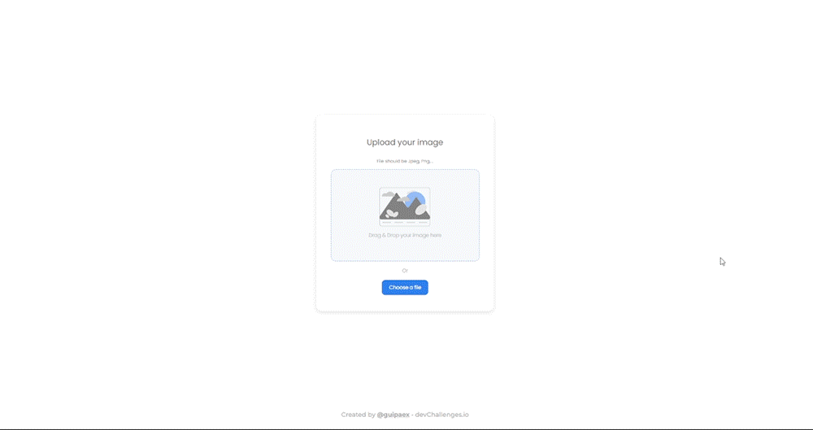

<!-- Please update value in the {}  -->

<h1 align="center">React Image uploader</h1>

   Solution for a challenge from  <a href="http://devchallenges.io" target="_blank">Devchallenges.io</a>.

  <h3>
    <a href="https://uploader-mu.vercel.app">
      Demo
    </a>
     | 
    <a href="https://github.com/guipaex/uPloader">
      Solution
    </a>
     | 
    <a href="https://devchallenges.io/challenges/O2iGT9yBd6xZBrOcVirx">
      Challenge
    </a>
  </h3>

<!-- TABLE OF CONTENTS -->

## Table of Contents

- [Overview](#overview)
  - [Built With](#built-with)
- [Features](#features)
- [Contact](#contact)
- [Acknowledgements](#acknowledgements)

<!-- OVERVIEW -->

## Overview

This project is a image uploader that you can use to share pictures through a direct link. You can test and use at [THIS LINK](https://uploader-mu.vercel.app"). In this project a was learned a little bit more about Typing and React Hooks, improving my skills with react develpment and getting practice with TypeScript.

### Built With

<!-- This section should list any major frameworks that you built your project using. Here are a few examples.-->

- [React](https://reactjs.org/)
- [Cloudinary](https://cloudinary.com/)

## Features

<!-- List the features of your application or follow the template. Don't share the figma file here :) -->

This application/site was created as a submission to a [DevChallenges](https://devchallenges.io/challenges) challenge. The [challenge](https://devchallenges.io/challenges/O2iGT9yBd6xZBrOcVirx) was to build an application to complete the given user stories.

## Acknowledgements

<!-- This section should list any articles or add-ons/plugins that helps you to complete the project. This is optional but it will help you in the future. For example -->

- [React-Dropzone](https://react-dropzone.js.org)
- [Cloudinary](https://cloudinary.com/)

## Contact

- Website [guipaes.com](https://guipaes.com)
- GitHub [@guipaex](https://{github.com/guipaex})
- LinkedIn [guilhermepaes](https://{https://www.linkedin.com/in/guilhermepaes/})
